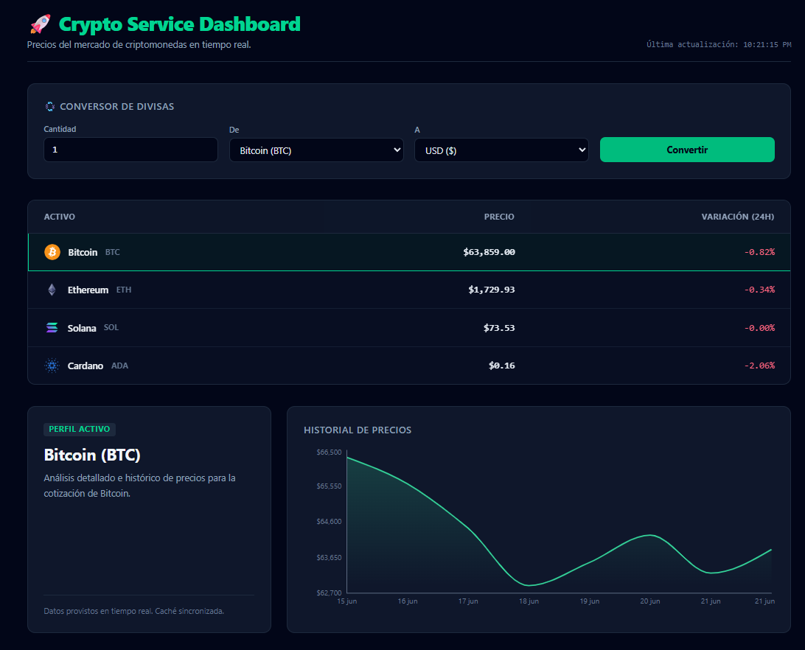

# 🚀 Crypto Service Dashboard - Frontend

Select Language / Selecciona el Idioma:
* [English Version](#-english-version)
* [Versión en Español](#-versión-en-español)

---

## 🇪🇸 Versión en Español

Una interfaz moderna, responsiva y reactiva desarrollada en **React** y **TypeScript** para el monitoreo de criptomonedas en tiempo real, análisis de gráficos históricos y conversión precisa de divisas.

Este proyecto actúa como la capa de presentación que consume los servicios de nuestra arquitectura backend en Spring Boot.

---

## 🛠️ Tecnologías Utilizadas

* **React 18** & **TypeScript** (Tipado estricto de DTOs).
* **Vite** (Herramienta de construcción ultra rápida).
* **Tailwind CSS** (Estilizado moderno con soporte nativos para Dark Mode).
* **Recharts** (Gráficas vectoriales interactivas en SVG).
* **Axios** (Cliente HTTP para el consumo asíncrono de APIs).

---

## 💡 Características Principales

* **Mercados en Tiempo Real:** Tabla interactiva con ordenamiento de activos, precios actuales y porcentaje de variación en las últimas 24 horas.
* **Análisis Gráfico Dinámico:** Al hacer clic en cualquier fila de la tabla, se conecta al endpoint de detalles para renderizar una gráfica de área interactiva (`[timestamp, precio]`) con el histórico de la moneda.
* **Conversor Preciso (`/converter`):** Formulario integrado con validación de datos que calcula conversiones de cripto a fiat (y viceversa) interactuando con la lógica matemática del backend.

---




## ⚙️ Configuración e Instalación

1. Clona este repositorio:
```bash
  git clone [https://github.com/toledo96/crypto-frontend-service.git](https://github.com/toledo96/crypto-frontend-service.git)
```

2. Instala las dependencias de Node:
```
  npm install
```

3. Configura las variables de entorno (asegúrate de apuntar a tu backend de Spring Boot). Crea un archivo .env en la raíz:

```  
Fragmento de código
  VITE_API_BASE_URL=http://localhost:8080/api
```

4. Levanta el servidor de desarrollo:
```
  npm run dev
```

🔗 Proyecto Completo (Arquitectura Fullstack)
Este frontend requiere del ecosistema backend para funcionar. Puedes consultar el repositorio del servidor, la lógica de caché en Redis y las pruebas unitarias aquí:
👉 [https://github.com/toledo96/crypto-backend-service]


# 🚀 Crypto Service Dashboard - Frontend

Select Language / Selecciona el Idioma:
* [English Version](#-english-version)
* [Versión en Español](#-versión-en-español)

---

## 🇺🇸 English Version

A modern, responsive, and reactive web interface built with **React** and **TypeScript** for real-time cryptocurrency monitoring, historical price charts, and high-precision currency conversion. This project serves as the presentation layer that consumes the services from our custom Spring Boot backend architecture.

---

## 🛠️ Tech Stack

* **React 18** & **TypeScript** (Strict DTO typing).
* **Vite** (Ultra-fast build tool).
* **Tailwind CSS** (Modern utility-first styling with native Dark Mode support).
* **Recharts** (Interactive SVG-based vector charts).
* **Axios** (HTTP client for asynchronous API consumption).

---

## 💡 Key Features

* **Real-Time Markets:** Interactive data table featuring asset sorting, current pricing, and 24-hour price change percentages.
* **Dynamic Historical Charts:** Clicking any row in the table triggers a detailed fetch to render an interactive area chart (`[timestamp, price]`) showing the asset's 7-day trend.
* **Precise Converter (`/converter`):** An integrated form with input validation that handles crypto-to-fiat (and vice-versa) conversions by leveraging the backend's `BigDecimal` mathematical logic.

---


## ⚙️ Setup and Installation

1. Clone this repository:
```bash
  git clone [https://github.com/toledo96/crypto-frontend-service.git](https://github.com/toledo96/crypto-frontend-service.git)
```

2. Install the Node dependencies:
```
  npm install
```

3. Configure your environment variables. Create a .env file in the root directory:

```  
Fragmento de código
  VITE_API_BASE_URL=http://localhost:8080/api
```

4. Start the local development server:
```
  npm run dev
```

🔗 Full-Stack System Architecture
This frontend relies on a robust backend ecosystem to function. You can check out the server repository—featuring Redis caching integration and clean unit testing—right here:
👉[https://github.com/toledo96/crypto-backend-service]